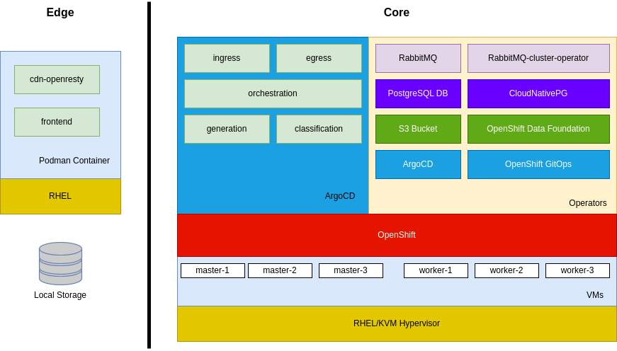

# image-gen

Spring Boot microservices for an image generation AI.

## Description

This project is a Spring Boot microservices project that generates images using an AI model.

The project is composed of the following services:

**Core Services**

- **ingress**: The entry point for the generation prompt (Spring Boot Web API)
- **orchestration-service**: The service that orchestrates the generation process (Spring Boot)
- **[classification-service](classification-service/README.md)**: The service that classifies the prompt (Flask Web API)
- **[generation-service](generation-service/README.md)**: The service that generates the image (Python RabbitMQ Worker)
- **egress-web-api**: The service that returns a status of a generation request and also the generated image (Spring Boot Web API)

**Edge Services**

- **cdn-openresty**: OpenResty nginx for caching images from egress API and serving frontend
- **frontend**: Basic Express.js frontend to interact with ingress/egress APIs

## System Components Overview

## Architectural Overview

## Screenshots

## Additional information about the cluster and services

- [Postgres notes](docs/postgres.md)
- [OpenShift notes](docs/OpenShift-notes.md)
